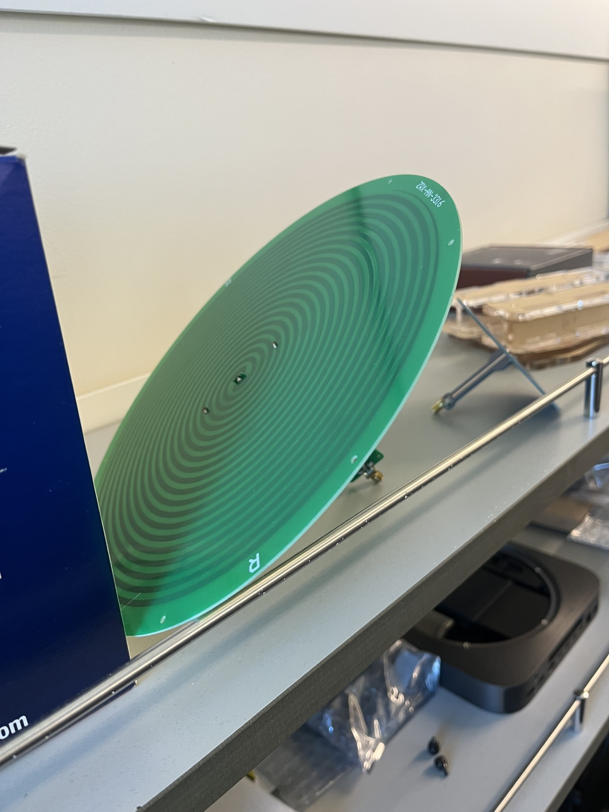
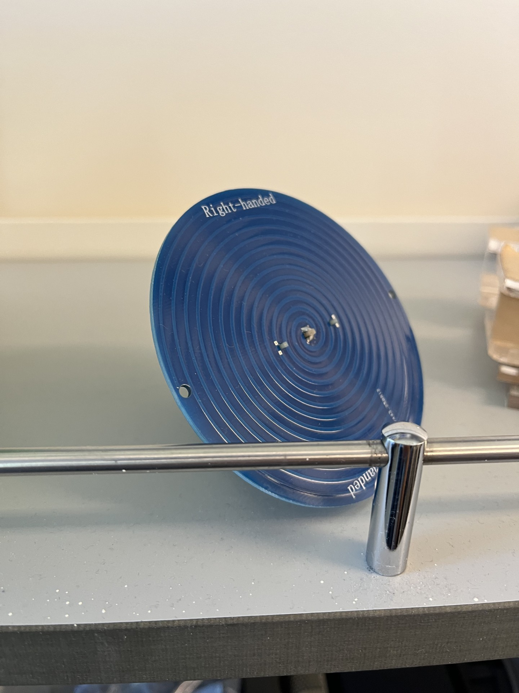
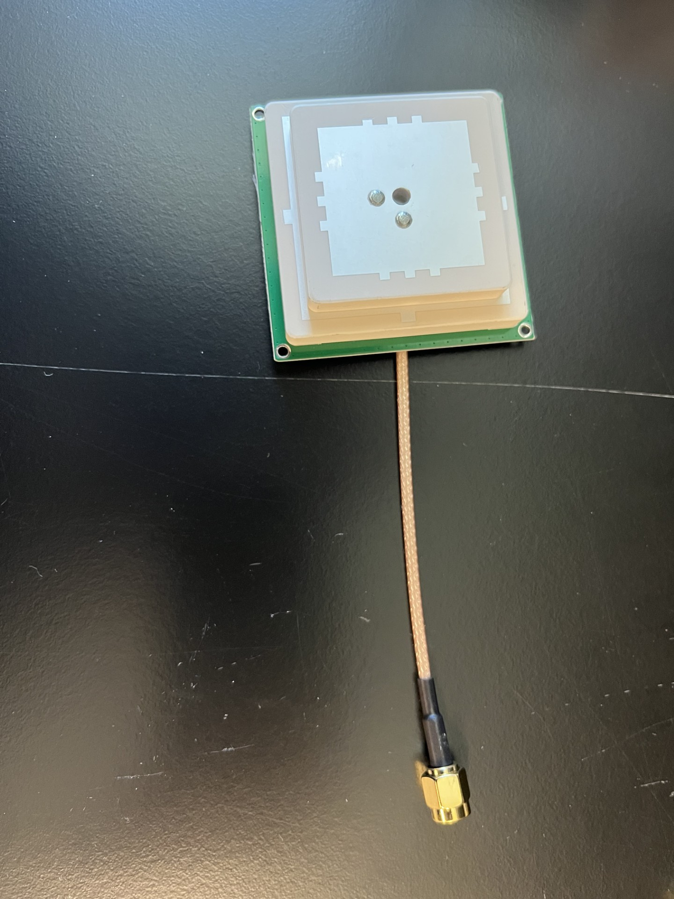
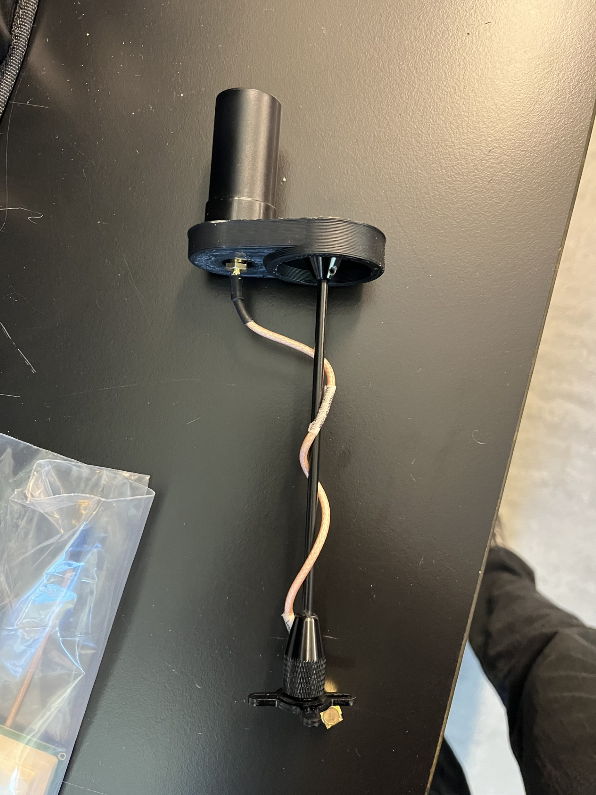

# Antennas

This document tracks the HERON antennas. It holds one section for each
antenna. Each section lists the photo, the source of the data, the
specifications, and the open items.

Rules for this document:

- A value is copied from a named source. Do not add a value without a
  source.
- A missing value says **TBD**. Do not guess it.
- The antenna IDs (`ANT-01` to `ANT-04`) are only names for this
  document. They are not the `antenna_label` values in the config files
  and not the physical labels. The label scheme is open (see section 6).
- When an antenna gets a role (direct or reflected) or a channel, update
  this document and `HARDWARE.md` section 3 in the same change.

## 1. Summary

| ID | Antenna | Type | Polarization | Role | Data status |
| --- | --- | --- | --- | --- | --- |
| ANT-01 | Large green spiral PCB, marked `ZRX-AN-3316` and `R` | Spiral (looks like an Archimedes spiral) | **TBD** (the `R` mark may mean right-handed; not confirmed) | **TBD** | Photo only. No datasheet yet |
| ANT-02 | Blue spiral PCB, marked "Right-handed" | Archimedes spiral, 0.6–7 GHz | Right-handed circular | **TBD** | Vendor text from the user, in section 3 |
| ANT-03 | Abracon APKG5012GD active dual-band stacked patch. The team calls it the "Patch antenna" (D-032) | Active patch, LNA 40 ± 2 dB | RHCP | **TBD** | Datasheet, in section 4 |
| ANT-04 | ArduSimple lightweight helical multiband GNSS antenna. The team calls it the "Flight antenna" (D-032) | Active helical, L1/L2 | RHCP | **TBD** | Datasheet, in section 5 |

## 2. ANT-01: large green spiral PCB

What the photo shows:

- A green FR4 disc with a spiral trace. It has mounting holes near the
  rim.
- The text `ZRX-AN-3316` is on the rim. A letter `R` is on the board
  near the lower rim.
- A small PCB with an SMA connector is on the back.

Unknown (**TBD**): vendor, model, bandwidth, gain, axial ratio, diameter,
handedness, connector type, role.

## 3. ANT-02: blue spiral PCB (right-handed)

Source: product text that the user pasted on 2026-10-03. The text is
copied below with no change to the values. The vendor and the model are
**TBD**.

Title: "Right-handed 0.6-7GHz UWB Antenna Circular Polarization Archimedes
Spiral Antenna with SMA Female Connector".

| Item | Value |
| --- | --- |
| Working bandwidth | 610 MHz – 7 GHz |
| Polarization | Circular, right-handed (the vendor also sells a left-handed version) |
| Axial ratio | < 1.5 dB |
| Radiation angle | H = E = 70 degrees |
| Gain | 5 dBi – 7 dBi (the text also says 5–7 dBi circularly polarized directional gain over 600 MHz – 7 GHz) |
| Impedance | 50 ohm |
| SWR | < 2.4 (the text also says < 2 from 610 MHz to 7 GHz, and 1.5 < VSWR < 3 from 540 MHz to 610 MHz) |
| Return loss | Less than -10 dB in the vendor test images |
| Size | Spiral diameter 150 mm, height 53 mm |
| Material | FR4 PCB, equiangular spiral, gradient feed line for impedance match |
| Connector | SMA female |
| Typical use named by the vendor | 915 MHz, 1090 MHz ADS-B, 1268–1610 MHz GPS, 1420 MHz, 2.4 GHz and 5.8 GHz |

Notes:

- The vendor text disagrees with itself on the lower band edge (600 MHz,
  610 MHz, and 540 MHz) and on the SWR limit (< 2 and < 2.4). Measure
  the antenna before you rely on these values.
- The photo does not show the connector. Check the real connector on
  the bench.

Related paper: the user believes the paper in
`Hardware/datasheets/Dahalan2013-Archimedean-spiral-band-notched-PIERC37.pdf`
corresponds to this antenna. This is **not confirmed**. The paper
describes a different design:

| Item | Paper (Dahalan et al., PIER C vol. 37, 2013) | Vendor text above |
| --- | --- | --- |
| Frequency range | 3.1 – 10.6 GHz, with a notch at 5.8 GHz | 0.6 – 7 GHz |
| Board size | 60 × 66 mm, 1.6 mm FR4 | 150 mm diameter |
| Feed | Coplanar waveguide (CPW), two arms | Gradient line (vendor text) |

The paper does not cover the GNSS L-band (1.1 – 1.6 GHz). Use the paper
as background reading about Archimedean spirals only. Do not use its
numbers as ANT-02 data.

## 4. ANT-03: Abracon APKG5012GD active stacked patch

The team calls this antenna the "Patch antenna" (D-032). The recorder
files of `20261001_URSP_Testing` use that name (see D-031).

Source: `Hardware/datasheets/Abracon-APKG5012GD-datasheet.pdf` (Abracon,
revised 2026-04-26). The user confirmed on 2026-10-06 that this antenna is
active with about 40 dB of gain, and that the datasheet is for it.

| Item | Value |
| --- | --- |
| Type | Active dual-band stacked ceramic patch with LNA |
| Bands | GPS L1, L5. Galileo E1, E5a. GLONASS G1. BeiDou B1, B2a. IRNSS L5. SBAS L1, L5. QZSS L1, L5 |
| Polarization | RHCP |
| Antenna gain (maximum) | 4.0 dBic at 1575.42 MHz; more than 3.5 dBic at 1176.45 MHz |
| Antenna VSWR | 2 or less (datasheet plots: 1.21 at 1575 MHz, 1.23 at 1175.5 MHz) |
| LNA gain | 40 ± 2 dB. Table: 39.299 dB at 1.176 GHz, 38.389 dB at 1.561 GHz, 39.970 dB at 1.575 GHz, 39.395 dB at 1.602 GHz |
| LNA noise figure | 1.5 dB or less |
| LNA out-of-band rejection | 55 dB |
| Supply voltage | 3.3 to 10 V |
| Supply current | 34 ± 3 mA |
| Impedance | 50 ohm |
| Size | 50 × 50 × 12 mm (board 56 × 56 mm) |
| Cable and connector | RG316, 105 mm (90 ± 2 mm in the drawing), SMA-J (male) |
| Temperature | -40 to +85 °C (operation) |

Notes for the HERON design:

- This antenna covers both L1 and L5. The Flight antenna (ANT-04) lists
  no L5.
- The antenna needs DC power (3.3 to 10 V) on the RF cable.
- The datasheet states the gain of the antenna and of the LNA apart. Gain
  at the cable output is the LNA gain plus the antenna gain minus the
  cable loss. The datasheet gives no total figure.

## 5. ANT-04: ArduSimple lightweight helical multiband GNSS antenna

The team calls this antenna the "Flight antenna" (D-032).

The photo shows the antenna in a 3D-printed holder with a cable and a
rod. The holder is not part of the vendor product.

Source: `Hardware/datasheets/ArduSimple-AS-ANT2B-HEL-L1L2-SMA-00-datasheet.pdf`
(ArduSimple, last modified 2026-07-08). SKU: `AS-ANT2B-HEL-L1L2-SMA-00`.

| Item | Value |
| --- | --- |
| Type | Active helical antenna with built-in LNA |
| Bands | GPS L1, L2. GLONASS G1, G2. BeiDou B1, B2. Galileo E1, E5b. QZSS L1, L2. SBAS: WAAS, EGNOS, MSAS, GAGAN |
| Polarization | RHCP |
| Peak gain | 2 dBi |
| Axial ratio at zenith | < 3 dB |
| Azimuth coverage | 360 degrees |
| Impedance | 50 ohm |
| Supply voltage | 3 – 16 V |
| Supply current at 3 V | 35 mA (typical) |
| LNA gain | 33 dB (average) |
| Noise figure | 1.5 dB (maximum) |
| VSWR | 2 (maximum) |
| Length | 56 mm (maximum); 55.6 mm in the drawing |
| Diameter | 27.5 mm (drawing) |
| Mass | 18 g |
| Connector | SMA male, mounts straight on the SMA connector |
| Phase center | See the drawing on page 4 of the datasheet (L1 and L2 heights are shown there) |
| Temperature | -40 to +85 °C (operation and storage) |
| IP rating | IP67 |

Notes for the HERON design:

- **L5 is not in the band list.** The datasheet lists no GPS L5
  (1176.45 MHz) and no Galileo E5a. The legacy settings in `HARDWARE.md`
  use L5. Q-001 (signal plan) is open. Test this antenna at the band you
  plan to use.
- **The antenna needs DC power** (3 – 16 V) on the RF cable. The SDR RX
  inputs do not give this voltage by default. How to power it is
  **TBD**. Ask the user before you choose a method.
- ArduSimple says the antenna is a lower-cost alternative to the
  Holybro HANT-8605A.

## 6. Open items

| Item | Needed from | Status |
| --- | --- | --- |
| Vendor, model, and datasheet for ANT-01 | User | **TBD** (user has no documents yet) |
| Role of each antenna (direct or reflected) | User | **TBD** |
| Antenna-to-SDR-channel map and the `antenna_label` scheme | User | **TBD** (`HARDWARE.md` section 3) |
| Source of the ANT-02 vendor text (link or order number) | User | **TBD** |
| Whether the Dahalan paper really matches ANT-02 | User | Open; the data disagree (section 3) |
| LNA, filter, and bias-tee plan for each antenna | User | Draft in `RF_FRONT_END.md` (bias tee ZFBT-4R2G-FT+, one per antenna) |
| Measured data (VSWR, gain, axial ratio) for each antenna | Bench test | **TBD** |
