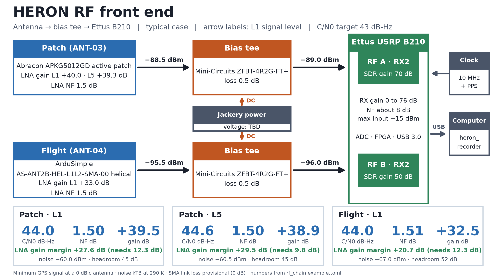
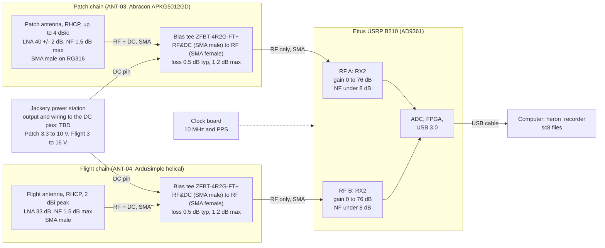

# RF front end: Patch and Flight antennas on one B210

This document shows the RF chain from the antenna to the SDR. It covers
the Patch antenna (ANT-03, Abracon APKG5012GD) and the Flight antenna
(ANT-04, ArduSimple helical) on one Ettus B210. Each antenna goes through
its own Mini-Circuits ZFBT-4R2G-FT+ bias tee. It also holds the gain and
noise budget for the chain.

Status: draft. Some inputs are **TBD**. Each one is marked. Section 6
lists them.

All numbers in section 4 come from `Hardware/rf_chain/rf_chain.example.toml`.
The tool `Hardware/rf_chain/link_budget.py` makes them. Do not edit the
numbers here by hand. Change the config and run the tool again (section 5).

## 1. Block diagram



The figure comes from the tool in section 5. It shows the typical case.
The Mermaid version below is the same structure in text form.

Each bias tee has one RF path, so the design needs **one bias tee for each
antenna**. The RF port assignment (A or B) follows the 2026-10-01 test
(D-029). It is not a flight decision.



Connection notes:

- Bias tee RF port: SMA female. Bias tee RF&DC port: SMA male. The DC
  port is a feed-through pin.
- The antenna goes on the **RF&DC** port. The B210 goes on the **RF**
  port. The RF port blocks DC, so the supply voltage does not reach the
  B210.
- The B210 RX ports are SMA female. Both antennas have an SMA male
  connector. The user reported SMA connectors between the B210 RX ports,
  the bias tees, and the antennas. The part numbers and the loss of these
  links are **TBD**.
- The user reported a USB-A to USB-B cable between the computer and the
  B210. Check that it is rated for USB 3.0 and fits the B210 port (the
  B210 has a USB 3.0 Micro-B port, per the Ettus documents). USB 2.0
  limits the sample rate.

## 2. Inputs and sources

| Item | Value | Source |
| --- | --- | --- |
| Patch LNA gain | 40 ± 2 dB; 39.30 dB at L5 and 39.97 dB at L1 | `Hardware/datasheets/Abracon-APKG5012GD-datasheet.pdf` |
| Patch LNA noise figure | 1.5 dB or less | Same datasheet |
| Patch supply | 3.3 to 10 V; 34 ± 3 mA | Same datasheet |
| Flight LNA gain and noise figure | 33 dB (average); 1.5 dB (maximum) | `Hardware/datasheets/ArduSimple-AS-ANT2B-HEL-L1L2-SMA-00-datasheet.pdf` |
| Flight supply | 3 to 16 V; 35 mA at 3 V | Same datasheet |
| Bias tee frequency range | 10 to 4200 MHz | `Hardware/datasheets/MiniCircuits-ZFBT-4R2G-FT-datasheet.pdf` |
| Bias tee insertion loss | L1 about 0.5 dB; L5 about 0.4 dB (typical, L5 interpolated); 1.2 dB maximum | Same datasheet |
| Bias tee DC limits | 30 V and 500 mA maximum; 4.5 ohm DC resistance | Same datasheet |
| B210 RX gain range | 0 to 76 dB | [Ettus USRP B200/B210 manual](https://files.ettus.com/manual/page_usrp_b200.html) |
| B210 RX noise figure | Less than 8 dB | Distributor listing of the Ettus specification (for example [Digilent](https://digilent.com/shop/ettus-usrp-b210-2x2-70mhz-6ghz-sdr-cognitive-radio/)). **Not checked against the Ettus knowledge base** (it returned an error). The value at low gain settings is not in the sources I read |
| B210 maximum RF input | -15 dBm | Ettus manual (same page) |
| Noise bandwidth | 20.322 MHz (L5), 20 MHz (L1) | `onboard.example.toml` (placeholder; Q-001 open) |
| SDR gain settings used on 2026-10-01 | Patch 70 dB (RF A), Flight 50 dB (RF B) | D-029 |
| Minimum received signal | L1 C/A -128.5 dBm; L5 I5 -127.9 dBm, at a 0 dBic antenna | Public GPS interface specifications (IS-GPS-200, IS-GPS-705). **Not from the HERON docs. Confirm.** |

The signal levels are the minimum levels that the GPS specifications
guarantee. Real levels are higher. The budget uses them as a worst case.
The antenna gain in the budget is 0 dBic, the reference of those
specifications.

## 3. Assumptions in the numbers

- Both SMA links (one on each side of the bias tee) have 0 dB loss. This
  is a placeholder. The tool marks it "(provisional)".
- The antenna noise temperature is not included. Noise is kTB at 290 K.
- The B210 noise figure is 8 dB at every gain setting.
- The Flight antenna has no L5 entry, so the Flight chain has no L5 budget.

## 4. Budget results (typical case)

| | Patch, L1 | Patch, L5 | Flight, L1 |
| --- | --- | --- | --- |
| Gain, antenna to B210 input | +39.5 dB | +38.9 dB | +32.5 dB |
| Cascade noise figure | 1.50 dB | 1.50 dB | 1.51 dB |
| C/N0 at the minimum signal | 44.0 dB-Hz | 44.6 dB-Hz | 44.0 dB-Hz |
| Signal at the B210 input | -89.0 dBm | -89.0 dBm | -96.0 dBm |
| Noise at the B210 input | -60.0 dBm | -60.5 dBm | -67.0 dBm |
| Headroom to the -15 dBm input limit (noise) | 45.0 dB | 45.5 dB | 52.0 dB |
| B210 gain setting (D-029) | 70 dB | 70 dB | 50 dB |
| Total gain, antenna to B210 output | +109.5 dB | +108.9 dB | +82.5 dB |

In the worst case (`--case worst`: LNA gain at its low tolerance, bias tee
at its maximum loss) the Patch gain to the B210 input is 2.7 dB lower at
L1, and the noise figures and the C/N0 values stay the same.

What the numbers show:

- Both chains have a noise figure of about 1.5 dB. The LNA in the antenna
  sets it. The 1.2 dB bias tee loss and the B210 noise figure change it by
  less than 0.01 dB. If the B210 noise figure were 20 dB, the Flight chain
  would be about 1.7 dB.
- The B210 gain does not change C/N0. It sets how well the noise fills the
  ADC.
- The Patch chain has 7 dB more front-end gain than the Flight chain. The
  Patch noise at the B210 input is -60 dBm.
- **Check for clipping on 2026-10-01.** The Patch ran at 70 dB B210 gain
  with 39.5 dB of front-end gain. The noise at the B210 output reference is
  +10 dBm for the Patch and -17 dBm for the Flight, a difference of 27 dB.
  The tool does not model the ADC full-scale level. I do not have it from
  the sources. Look at the recorded Patch data for clipping.

### 4.1 Required gain for a C/N0 target of 43 dB-Hz

The user set the target at 43 dB-Hz on 2026-10-06. The target applies at
the minimum signal level of section 2 (0 dBic antenna). The tool solves
for the first-stage gain (the LNA in the antenna). The config section
`[requirements]` holds the target.

| | Patch, L1 | Patch, L5 | Flight, L1 |
| --- | --- | --- | --- |
| Best possible C/N0 (ideal receiver) | 45.5 dB-Hz | 46.1 dB-Hz | 45.5 dB-Hz |
| Largest cascade noise figure that meets 43 dB-Hz | 2.48 dB | 3.08 dB | 2.48 dB |
| Cascade noise figure now | 1.50 dB | 1.50 dB | 1.51 dB |
| **Minimum LNA gain** (typical case) | **12.3 dB** | **9.8 dB** | **12.3 dB** |
| Minimum LNA gain (worst case) | 13.1 dB | 10.7 dB | 13.1 dB |
| LNA gain now | +40.0 dB | +39.3 dB | +33.0 dB |
| Margin (typical case) | +27.6 dB | +29.5 dB | +20.7 dB |
| LNA gain for at most 0.5 dB of C/N0 loss from later stages | 15.5 dB | 15.4 dB | 15.5 dB |
| LNA gain for at most 0.1 dB of C/N0 loss from later stages | 22.7 dB | 22.5 dB | 22.7 dB |

What this means:

- Both antennas already meet 43 dB-Hz with a large margin. The LNA gain
  only has to keep the bias tee and the B210 noise from adding to the
  noise figure. About 12 dB is enough for 43 dB-Hz.
- The limit is the noise figure, not the gain. The 43 dB-Hz target needs
  a cascade noise figure of 2.48 dB or less at L1. An LNA with a noise
  figure above 2.48 dB cannot meet it at any gain.
- Without an LNA, the chain fails. The no-LNA case has a noise figure of
  about 8.5 dB and a C/N0 of about 37 dB-Hz (section 3, earlier
  hand calculation).
- More LNA gain than the "0.1 dB" row gives no useful C/N0 gain.
  Extra gain only moves the noise closer to the B210 input limit
  (headroom in section 4).
- **SDR gain: TBD.** The B210 gain does not change C/N0. It sets how well
  the noise fills the ADC. The tool needs the B210 ADC full-scale level
  at each gain setting for this. That level is not in my sources. The
  options are the Ettus data, a bench test, or a calibration from the
  recorded 2026-10-01 files (Patch at 70 dB, Flight at 50 dB).

## 5. How to run and change the budget

Run from `HERON_DEPLOY_SOFTWARE/` (it has the `pydantic` library):

```
uv run python ../Hardware/rf_chain/link_budget.py ../Hardware/rf_chain/rf_chain.example.toml
uv run python ../Hardware/rf_chain/link_budget.py ../Hardware/rf_chain/rf_chain.example.toml --case worst
```

To make the PNG figure, write the JSON results and draw them. The
drawing step needs only `matplotlib`, which is not in the workspace
environment:

```
uv run python ../Hardware/rf_chain/link_budget.py ../Hardware/rf_chain/rf_chain.example.toml --json budget.json
python ../Hardware/rf_chain/make_diagram.py budget.json ../docs/images/rf_front_end_block_diagram.png --dpi 200
python ../Hardware/rf_chain/make_diagram.py budget.json ../docs/images/rf_front_end_block_diagram_detailed.png --style detailed
```

The default style is `presentation` (16:9 slide with result cards). The
`detailed` style is the dense engineering figure,
`images/rf_front_end_block_diagram_detailed.png`.

(Run the second command with any Python that has `matplotlib`. I used the
one in `gps-tracking-example/.venv`.) Delete `budget.json` after you draw.

To change a value, edit the TOML file. Do not edit the code. The file has
these tables:

- `[environment]`: noise temperature and the case (`typical` or `worst`).
- `[bands.*]`: frequency, noise bandwidth, minimum signal.
- `[requirements]` (optional): the C/N0 target and extra C/N0-loss goals.
  The tool then prints the minimum first-stage gain for each chain and
  band.
- `[components.*]`: gain, noise figure, supply data of each part.
  A part with no noise figure and a loss uses a noise figure equal to the
  loss.
- `[[chains]]`: the parts in order, the SDR, the SDR gain, the supply
  voltage. Add `supply_voltage_v` to check the DC path (range, current,
  voltage drop in the bias tee). Without it the tool prints TBD.

The tool stops with a clear message when a part, a band, or a value is
missing, or when a key has a typo.

Tests: `uv run pytest ../Hardware/rf_chain/tests --import-mode=importlib`.
These tests are not yet in the `testpaths` of the workspace
`pyproject.toml`.

## 6. Open items

| Item | Needed from | Status |
| --- | --- | --- |
| Jackery model, its output port, and the wiring to the DC pins of the bias tees | User | **TBD** |
| Supply voltage (3.3 to 10 V keeps both antennas in range) | User | **TBD** |
| SMA adapter and cable part numbers and loss | User | **TBD** (provisional 0 dB) |
| B210 noise figure at the gain settings in use | Bench test or Ettus data | Not in the sources I read |
| ADC full-scale level and ADC fill (dBFS) at each gain setting | Recorded data, Ettus data | **TBD** |
| Clipping check of the 2026-10-01 Patch data at 70 dB | User or Claude on request | Open |
| Signal level references (-128.5 dBm, -127.9 dBm) | User to confirm | Not from HERON docs |
| Flight band plan (L1, L5, or both). ANT-04 lists no L5 | User (Q-001) | Open |
| Port plan for the flight (A or B, RX2) | User | **TBD** |
